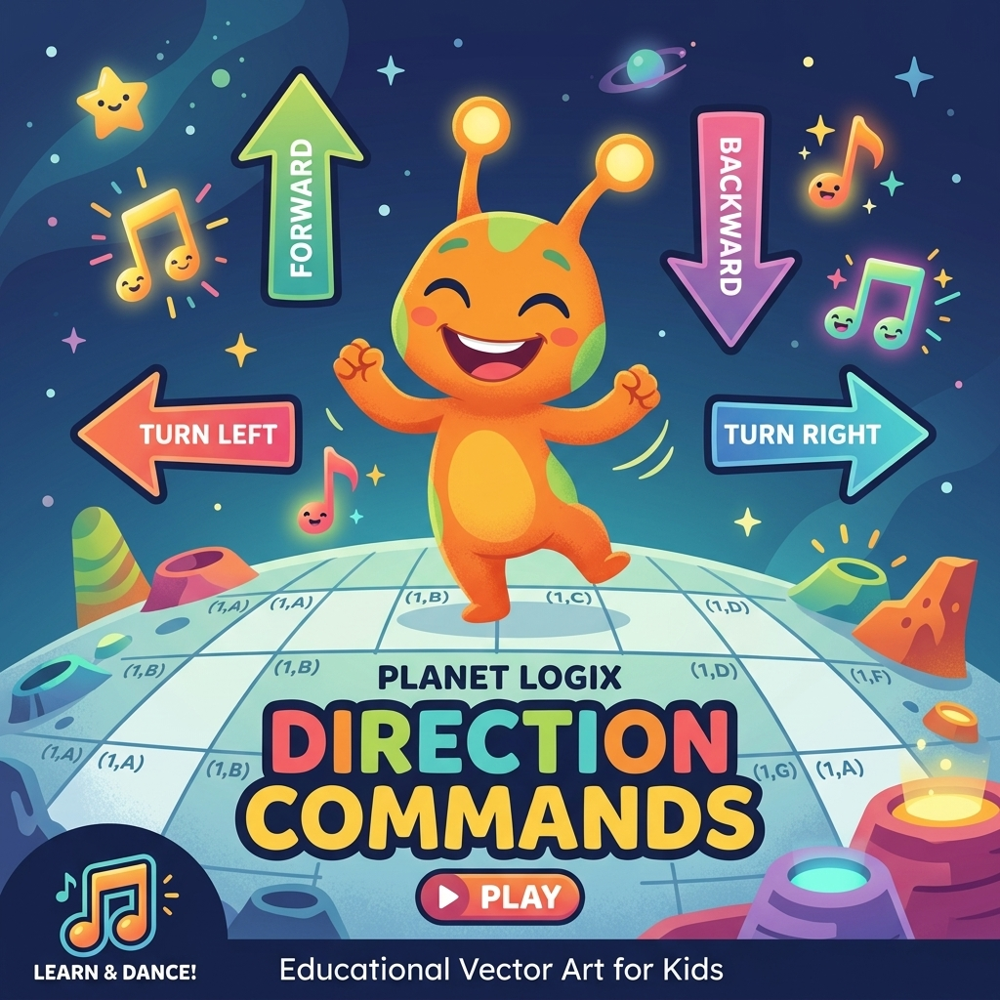
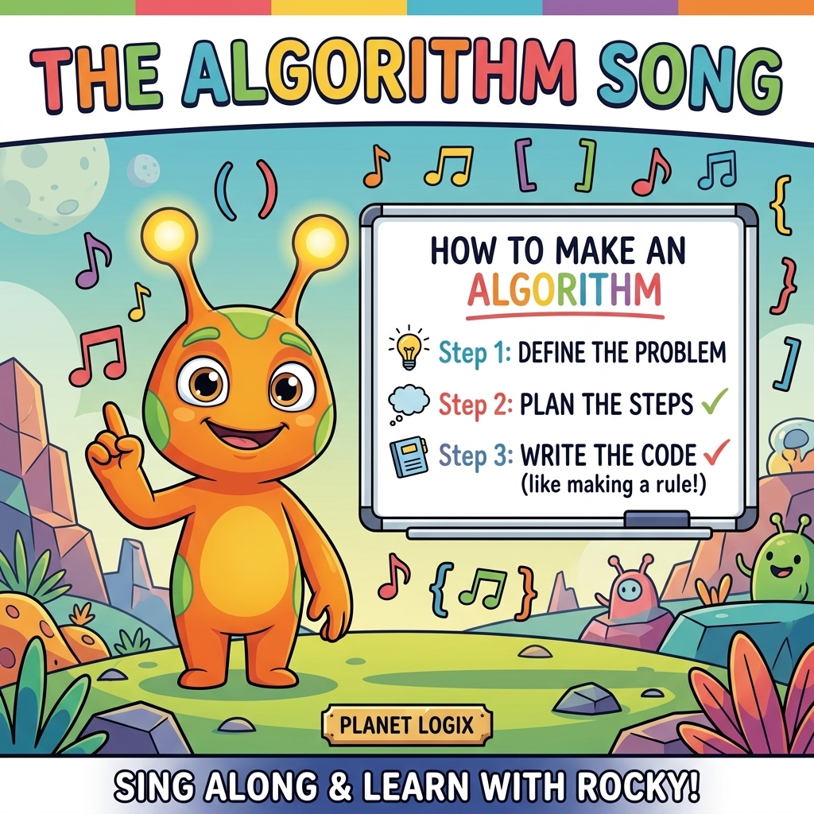
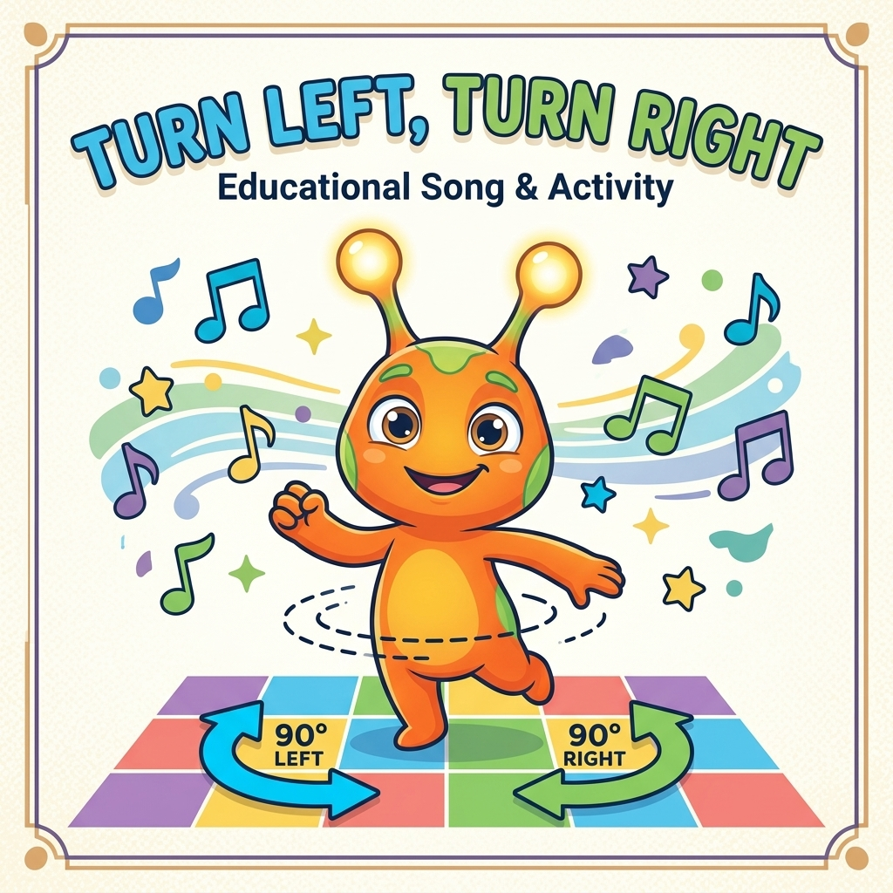
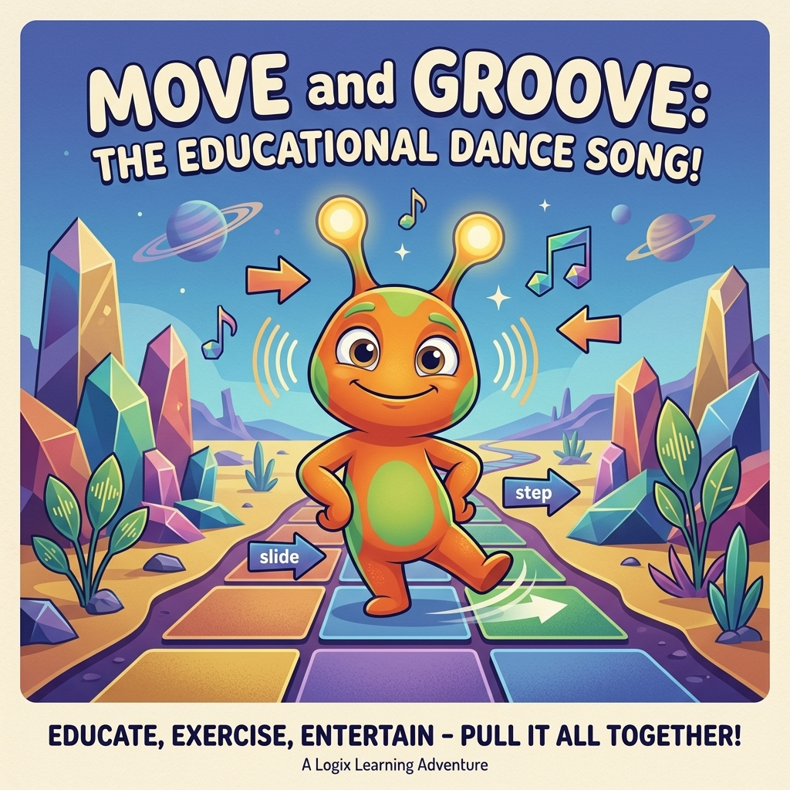
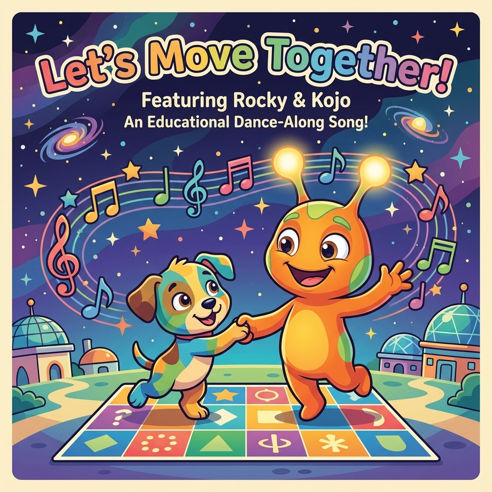

# 🎵 Rocky's Rhythms of Code: Computational Thinking 1 — Song & Movement Guide

Welcome, amazing educators! I am **Rocky**, your coding companion from **Planet Logix**! 🪐

Today, we are going to make our bodies move and our brains groove! In **Codesrock 1**, we believe that logic isn't something you just type on a screen—it's something you feel, sing, and dance. By singing these catchy, original tunes and combining them with active physical movement, your preschool and kindergarten students will master foundational coding concepts long before they ever touch a computer.

Let's rock the rhythm of code! 🤘🎵

---

## 📋 Curriculum Overview: Songs at a Glance

| Song Number & Title | Duration | Core Computational Concept | Physical Action Focus |
| :--- | :--- | :--- | :--- |
| **1. Direction Commands** | 2:07 | Directional Inputs & Grid Navigation | Moving Forward, Backward, Left, and Right |
| **2. The Algorithm Song** | 1:42 | Step-by-Step Sequencing & Precision | Order of operations (Step 1, 2, 3) |
| **3. Turn Left, Turn Right** | 1:50 | Rotational Orientation (90-Degree Spin) | Spinning in place vs. walking linear steps |
| **4. Move and Groove** | 1:37 | Debugging & Sequence Paths | Moving along grid paths, spotting obstacles |
| **5. Let's Move Together** | 1:55 | Collaborative Programming & Loops | Programmer-Robot pairs, active teamwork |

---

## 🗺️ Song 1: Direction Commands (Poster Card)

---

## 🗺️ Song 1: Direction Commands (Lyrics & Lesson Plan)

### 🎯 Pedagogical Objective:
This song teaches the four basic movements used in coding: **Forward**, **Backward**, **Turn Left**, and **Turn Right**. By linking these command words to specific bodily actions, children develop spatial mapping skills.

### 🎶 Lyrics & Movement Actions:
*(Sing to a high-energy, marching beat!)*

**Chorus:**
Listen up close, let's hear the call,  
Direction commands are for one and all!  
We look at the grid, we plan our way,  
Here are the words that we say today!  

**Verse 1:**
When I say **FORWARD**, what do you do?  
Take one big step, yes, me and you!  
`[Action: Everyone takes one step forward together!]`  
When I say **BACKWARD**, take a step back,  
Keep your balance and stay on the track!  
`[Action: Everyone takes one step backward together!]`  

**Chorus:**
Listen up close, let's hear the call,  
Direction commands are for one and all!  
We look at the grid, we plan our way,  
Here are the words that we say today!  

**Verse 2:**
Now turn your body, let's learn to spin,  
Spin to the **LEFT**, and let's begin!  
`[Action: Spin 90 degrees to the left in place!]`  
Spin to the **RIGHT**, feel the logic spark,  
Direction commands will hit the mark!  
`[Action: Spin 90 degrees to the right in place!]`  

**Outro:**
Forward! `[Step forward!]`  
Backward! `[Step back!]`  
Turn left! `[Spin left!]`  
Turn right! `[Spin right!]`  
We coded a path, and it feels so bright! 🌟  

### 🎓 Teacher's Circle-Time Guide:
1.  **Introduce the Cards:** Hold up the green `Forward` card, pink `Backward` card, orange `Turn Left` card, and blue `Turn Right` card as you sing the corresponding parts of the song.
2.  **The Simon Says Game:** Play the song and act as the Programmer. Hold up cards randomly and have students execute the actions. Start slow, then speed up!

---

## 📝 Song 2: The Algorithm Song (Poster Card)

---

## 📝 Song 2: The Algorithm Song (Lyrics & Lesson Plan)

### 🎯 Pedagogical Objective:
An **Algorithm** is a step-by-step list of instructions in a specific order. This song teaches children that order matters (precision) and how to break a big task into smaller steps (decomposition).

### 🎶 Lyrics & Movement Actions:
*(Sing to a rhythmic, bouncy hand-clapping beat!)*

**Chorus:**
An algorithm! An algorithm!  
A step-by-step recipe, follow the rhythm!  
An algorithm! An algorithm!  
We put them in order, no mixing with them!  
`[Action: Clap hands in rhythm with the syllables: Al-go-rith-m!]`  

**Verse 1:**
If you want to wash hands, or tie up your shoe,  
You need a clear plan of what you must do!  
**Step One:** Wet your hands! `[Action: Pretend to wash hands!]`  
**Step Two:** Apply soap!  
**Step Three:** Rinse it off, and dry it, we hope!  
If you mix up the steps, it won't work at all,  
You can't dry your hands before water can fall!  
`[Action: Shake hands in a "No, no" gesture!]`  

**Chorus:**
An algorithm! An algorithm!  
A step-by-step recipe, follow the rhythm!  
An algorithm! An algorithm!  
We put them in order, no mixing with them!  

**Verse 2:**
For Kojo the puppy to get to his bone,  
He needs the right steps, he can't go alone!  
First, walk! `[Stomp, stomp!]`  
Then turn! `[Spin around!]`  
Then walk straight ahead!  
Detailed instructions are how he is led!  
`[Action: Pretend to guide Kojo with index finger!]`  

**Outro:**
Step one, step two, step three, and go!  
That's how we write algorithms, you know! 🤘  

### 🎓 Teacher's Circle-Time Guide:
1.  **Order Mismatch Demonstration:** Ask students if they can wear their shoes *before* their socks. Let them laugh and explain why.
2.  **Chalk Checklist:** Write "Step 1, Step 2, Step 3" on the blackboard. Have kids think of algorithms for simple classroom routines (packing bags, cleaning tables).

---

## ↪️ Song 3: Turn Left, Turn Right (Poster Card)

---

## ↪️ Song 3: Turn Left, Turn Right (Lyrics & Lesson Plan)

### 🎯 Pedagogical Objective:
Differentiating between **linear translation** (stepping forward/backward) and **rotational orientation** (spinning in place) is one of the hardest concepts for preschoolers. This song focuses entirely on understanding that "Turn" means changing direction *without* leaving the current square.

### 🎶 Lyrics & Movement Actions:
*(Sing to a jazzy, spinning melody!)*

**Verse 1:**
Look at my feet, they are glued to the floor,  
I'm standing in place, but I want to see more!  
I'm facing the blackboard, I'm looking straight ahead,  
How do I look at the window instead?  
I don't walk forward, I don't walk back,  
I turn my whole body, I spin on the track!  

**Chorus:**
Turn left! `[Action: Jump and spin 90 degrees to the left, landing in place!]`  
Turn right! `[Action: Jump and spin 90 degrees to the right, landing in place!]`  
We spin on our toes, but we stay in our square!  
We turn our body to look over there!  
Turn left! `[Spin left!]`  
Turn right! `[Spin right!]`  
Keep your feet on the spot, keep your balance tight!  

**Verse 2:**
A turn is a pivot, a 90-degree spin,  
You face a new way for the goal you will win!  
If you face North and you want to face East,  
Turn to the right, it's a one-second feast!  
`[Action: Face the front of the room, then turn right to face the side wall!]`  

**Chorus:**
Turn left! `[Spin left!]`  
Turn right! `[Spin right!]`  
We spin on our toes, but we stay in our square!  
We turn our body to look over there!  

### 🎓 Teacher's Circle-Time Guide:
1.  **The Glue Game:** Draw a circle on the floor with chalk. Have a child stand inside it. Tell them their feet are "glued" to the circle. Give commands: *"Forward!"* (They must try to step but can't, showing it's invalid). *"Turn Right!"* (They spin in place). This physical constraint reinforces the concept beautifully.

---

## 🏃‍♂️ Song 4: Move and Groove (Poster Card)

---

## 🏃‍♂️ Song 4: Move and Groove (Lyrics & Lesson Plan)

### 🎯 Pedagogical Objective:
This song teaches path planning, sequence building, and **debugging**. Children learn to connect multiple direction cards together to create a continuous movement path on a grid.

### 🎶 Lyrics & Movement Actions:
*(Sing to a groovy, funky dance-along beat!)*

**Chorus:**
Move and groove, move and groove,  
Let's see how our body can move!  
Put the cards in a line, step-by-step,  
Follow the code that our programmer prepped!  
`[Action: Slide to the left, slide to the right in rhythm!]`  

**Verse 1:**
One card says **Forward**, so I take a stride,  
`[Action: Move one square forward!]`  
Next card says **Turn Right**, I spin on my side,  
`[Action: Spin 90 degrees to the right!]`  
Next card says **Forward**, I step once again,  
`[Action: Move one square forward!]`  
We build a long chain from one up to ten!  

**Chorus:**
Move and groove, move and groove,  
Let's see how our body can move!  
Put the cards in a line, step-by-step,  
Follow the code that our programmer prepped!  

**Verse 2:**
Uh-oh, there's a wall! There's a block in the way!  
Our algorithm failed, we have gone astray!  
`[Action: Put hands on cheeks in surprise!]`  
Find the bug, find the bug, find the mistake,  
What is the correct turn we need to make?  
Debug the code, and clear up the line,  
Now we can groove and everything is fine!  
`[Action: Pretend to dust off hands and smile!]`  

### 🎓 Teacher's Circle-Time Guide:
1.  **The Floor Mat Groove:** Lay out a 3x3 tape grid on the floor. Place physical direction cards next to the grid. Have children walk along the grid, stepping only when they read the next card in the line.
2.  **Spot the Bug:** Intentionally place an obstacle (like a chair) on the grid and lay out a buggy sequence cards line that walks straight into the chair. Let the children shout *"Bug! 🐛"* and help you replace the wrong card to "debug" the path.

---

## 🤝 Song 5: Let's Move Together (Poster Card)

---

## 🤝 Song 5: Let's Move Together (Lyrics & Lesson Plan)

### 🎯 Pedagogical Objective:
Collaboration is a key computational thinking skill. This song teaches children to work in pairs as **Programmer** (the composer of the algorithm) and **Robot** (the executor of the algorithm).

### 🎶 Lyrics & Movement Actions:
*(Sing to a warm, uplifting anthem beat!)*

**Chorus:**
Let's move together, let's code hand-in-hand,  
We are the programmers of Planet Logix land!  
I write the steps, and you walk the track,  
Programmer and Robot, we've got each other's back!  
`[Action: Partners face each other, join hands, and sway side-to-side!]`  

**Verse 1:**
I hold the cards, I'm the Programmer today,  
I choose the directions to guide you on your way!  
`[Action: Partner A holds up card symbols!]`  
You are the Robot, you listen so clear,  
You follow my code, and you show no fear!  
`[Action: Partner B stands in a funny robot pose!]`  

**Chorus:**
Let's move together, let's code hand-in-hand,  
We are the programmers of Planet Logix land!  
I write the steps, and you walk the track,  
Programmer and Robot, we've got each other's back!  

**Verse 2:**
We collaborate, we check and we share,  
If there is a bug, we show that we care!  
We debug together, we make the path right,  
Our spaceship is ready to launch into the night!  
`[Action: Both partners raise hands high in a high-five gesture!]`  

**Outro:**
Programmer and Robot! `[High five!]`  
Let's dance and play!  
We rock the code in a collaborative way! 🤘✨  

### 🎓 Teacher's Circle-Time Guide:
1.  **Pair Play:** Divide the class into pairs. Hand one set of direction cards to Partner A (Programmer). Partner B (Robot) stands on the starting tile. Have them take turns programming each other to reach goals (like fetching a pencil).
2.  **Language Check:** Ensure children use clear, precise verbal commands (*"Forward"* instead of *"Walk there"*).

---

## 🌟 Rocky's Golden Rules for Singing the Code:

1.  **Keep it Screen-Free!** 🚫💻  
    *   No screens, no laptops! Just use cards, blackboard chalk, and physical bodies.
2.  **Every Error is just a Bug!** 🐛  
    *   If a student does the wrong movement, laugh and shout: *"Aha, a bug! Let's debug it together!"* Never make them feel like they failed.
3.  **Physical Memory is Permanent!** 🧠🏃‍♂️  
    *   When kids step forward while shouting *"Forward"*, their motor cortex locks in the coding command.

**Keep Rocking the Code! 🤘**

*Your friend,*  
**Rocky** 🍊✨
