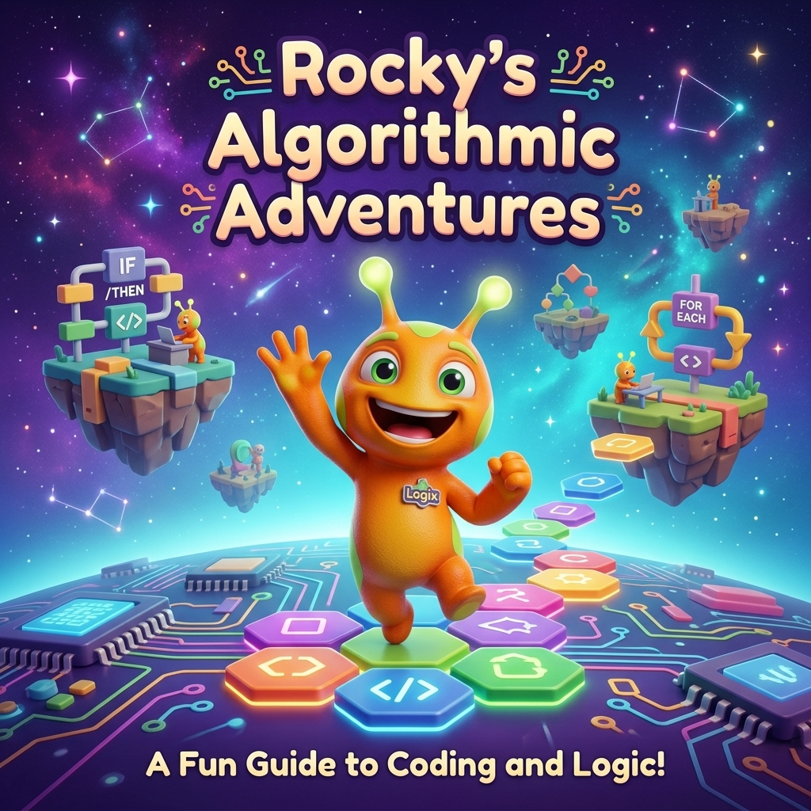
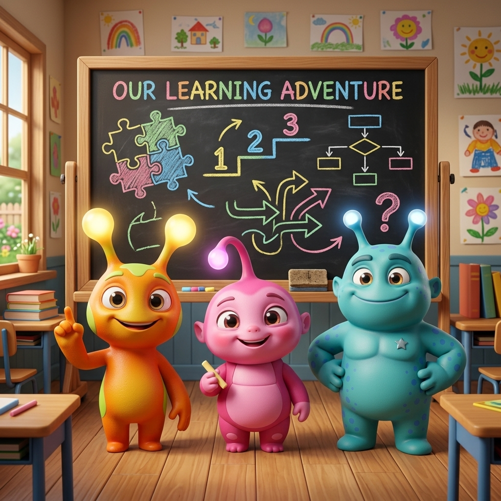
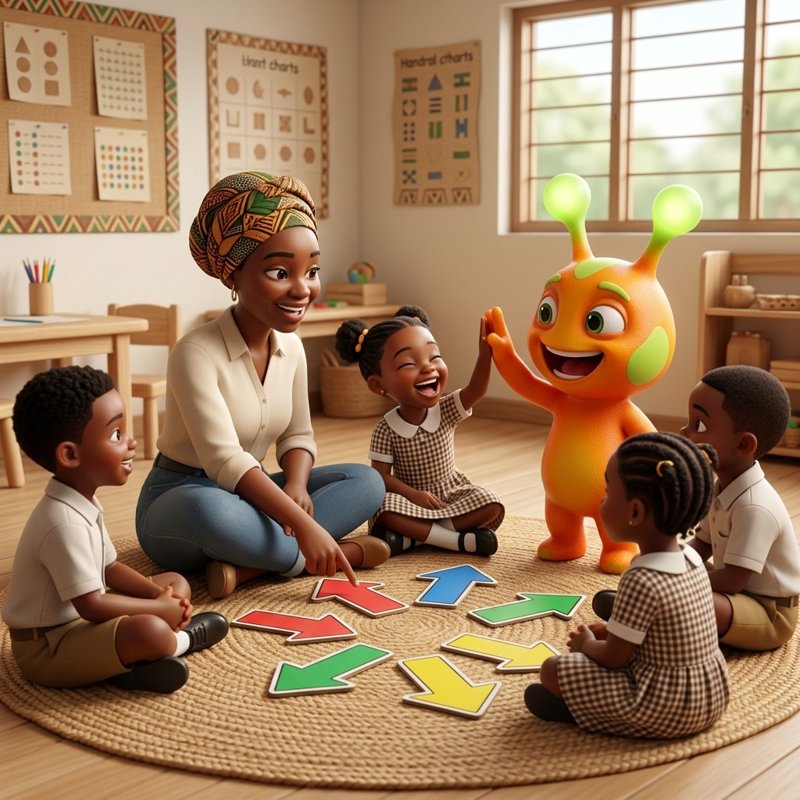
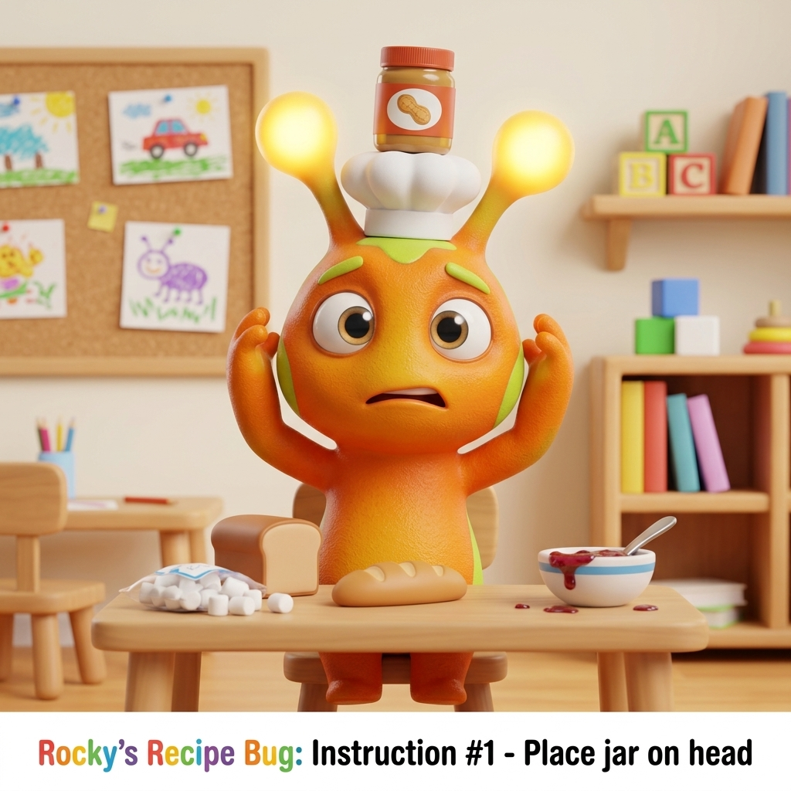
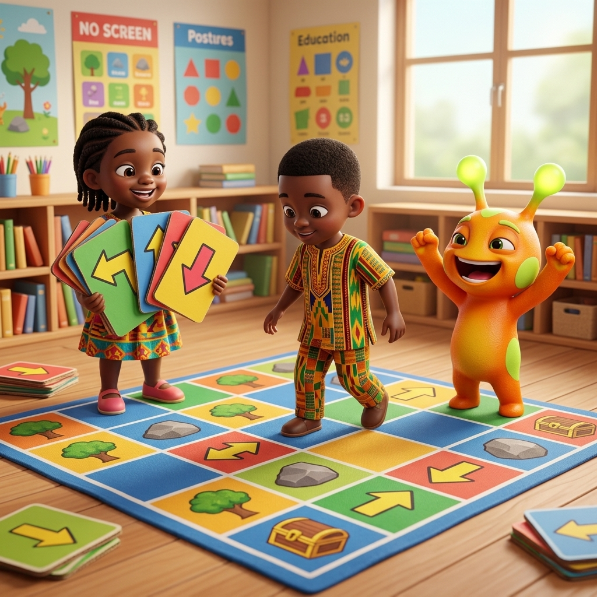
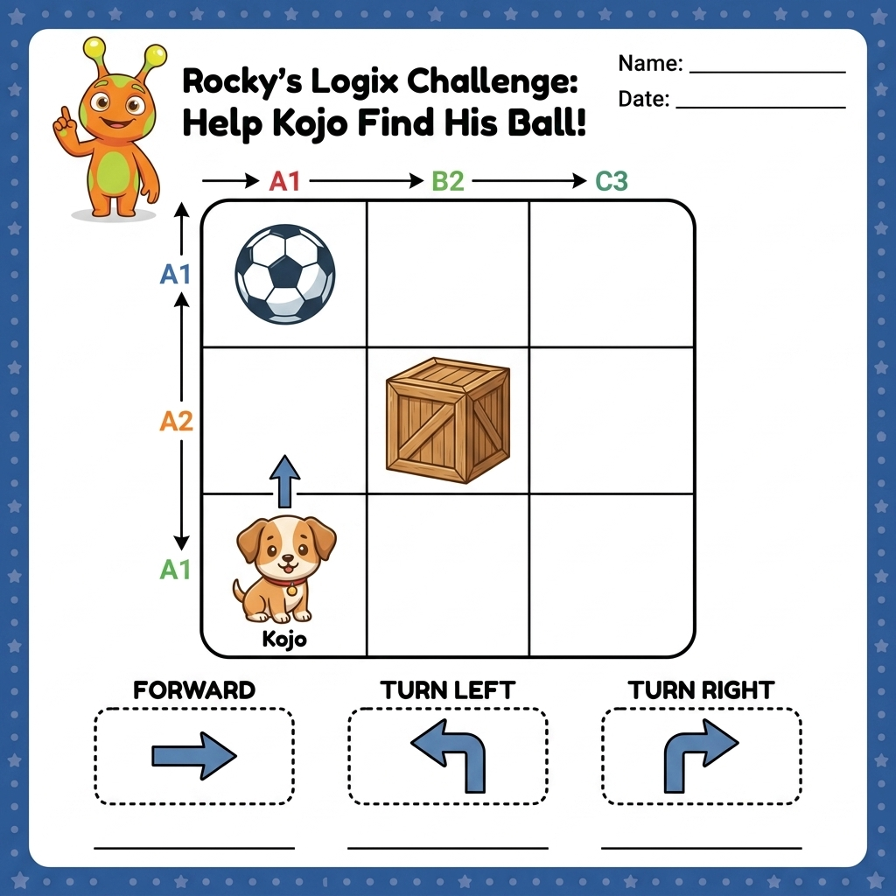

# 🤘 Rocky's Algorithmic Adventures: Computational Thinking 1 — Teacher's Resource Guide

Welcome, amazing educators! I am **Rocky**, your logic companion from **Planet Logix**! 🪐

Today, we are going on an unplugged, screen-free adventure. Together, we'll learn how to teach young learners (ages 3–6) the magic of **Algorithms** and **Sequencing**. No computers, no tablets, and no screens required—just our bodies, physical movement, and active minds!

Let's make some logic sparks fly! ✨

---

## 📖 Page 1: Welcome to Planet Logix!

Here is the cover of our learning booklet. Look at us getting ready to learn how directions work:

> **Rocky's Voice:** *"I love the rhythm of logic! Coding isn't about typing on a screen; it's about finding the beat and taking step-by-step turns to reach a goal. Let's rock the code! 🤘"*

---

## 🧭 Page 2: The Teacher's Vocabulary Chest

Before we teach the kids, let's make sure we understand the logic terms. Here are some simple, kid-friendly definitions you can use on a blackboard or during circle time:

### 1. Algorithm
*   **Definition:** A step-by-step list of instructions in a specific order to finish a task.
*   **Kid-Friendly Explanation:** *"A recipe for a robot to get a job done!"*
*   **Real-world Example:** The order of steps to wash hands: (1) Wet hands, (2) Apply soap, (3) Rub hands, (4) Rinse, (5) Dry.

### 2. Sequencing
*   **Definition:** Putting instructions in the exact correct order.
*   **Kid-Friendly Explanation:** *"Doing things in the right order so they work. Socks *before* shoes!"*
*   **Real-world Example:** Putting a diaper on *before* pants, or opening a wrapper *before* eating candy.

### 3. Precision
*   **Definition:** Being extremely clear, detailed, and exact with instructions.
*   **Kid-Friendly Explanation:** *"Speaking clearly to a robot so it doesn't get confused!"*
*   **Real-world Example:** Saying "Take two small steps forward" instead of just "Go there."

### 4. Decomposition
*   **Definition:** Breaking down a big problem into smaller, easier steps.
*   **Kid-Friendly Explanation:** *"Breaking a giant puzzle into tiny baby steps!"*
*   **Real-world Example:** Cleaning a messy room by focusing on putting away books first, then toys, then clothes.

### 5. Debugging
*   **Definition:** Finding an error (a "bug") in a sequence and fixing it.
*   **Kid-Friendly Explanation:** *"Finding where the path went wrong and fixing the recipe!"*
*   **Real-world Example:** Realizing you wore your shirt backwards and turning it around.

---

## 🏫 Page 3: Pedagogical Guide — How to Get the Best Out of Students

Teaching logic to 3–6 year olds is about building confidence, active movement, and a positive mindset toward mistakes. 

### 1. Build an "Error-Positive" Classroom Culture 🐛
*   Children are often afraid of being wrong. In coding, **errors are just bugs**—and bugs are opportunities to learn!
*   **Actionable Tip:** When a child plans a wrong path, celebrate it! Shout: *"Aha! We found a bug! 🐛 Who can help me debug this?"* This makes problem-solving feel like a fun puzzle instead of a failure.

### 2. Start Kinesthetic (Bodies First!) 🏃‍♂️
*   Preschoolers learn best when moving their physical bodies. Before drawing on paper or using grids, have them walk paths themselves.
*   Let them pretend to be Kojo the puppy or Rocky. Physical navigation builds spatial reasoning, which is the foundation of sequencing.

### 3. Ask Guiding Questions instead of Giving Solutions 🗣️
Instead of telling a student: *"No, you need to turn right,"* ask:
*   *"Where is Kojo looking right now?"*
*   *"If we take one step forward, where will we land?"*
*   *"What is blocking Kojo's path?"*
*   *"How can we help Kojo turn toward the ball?"*

### 4. Encourage Peer Collaboration 🤝
*   Coding is a social activity! Let kids work in pairs: one as the "Programmer" giving directions, and one as the "Robot" executing them. This builds language, teamwork, and active communication.

---

## 🥪 Page 4: The Silly PB&J Robot (Precision & Order)

This is an interactive classroom lesson that gets children laughing while teaching them why robots need *exact* instructions.

### The Setup:
The teacher acts as a "Robot" who wants to make a peanut butter sandwich. The students are the "Programmers." The teacher has a loaf of bread, a jar of peanut butter, a jar of jelly, and a plastic knife.

### The Rules:
The teacher will only do *exactly* what the children say.

### The Fun (and the Debugging!):
*   **Student says:** *"Put the peanut butter on the bread!"*
    *   *What the teacher does:* Places the closed, plastic jar of peanut butter on top of the unopened loaf of bread (just like in the illustration!).
*   **Students laugh and say:** *"No, open the jar first!"*
    *   *What the teacher does:* Smashes the jar open or tears the lid off with teeth.
*   **Students clarify:** *"Use the knife to put peanut butter on the bread!"*
    *   *What the teacher does:* Takes the knife, dips the handle in the jar, and smears it on the crust.

### What they learn:
Children realize that algorithms must be **detailed, precise, and in the correct order**.

---

## 🏃‍♀️ Page 5: The Human Robot Game (Kinesthetic Learning)

**Ages:** 3–6 | **Materials:** Painter's tape, foam floor tiles, or chalk.

This activity matches the **`Move and Groove`** and **`Intro to directions`** videos!

### Setup:
1. Create a simple grid on the classroom floor using painter's tape or foam tiles (e.g., a 3x3 or 4x4 grid).
2. Place a "Goal" (like a stuffed toy, a book, or a star) on one of the squares.
3. Place a child or a toy at the "Start" square.

### How to Play:
1. One child plays the **Programmer**, and another plays the **Robot** (they can pretend to be Rocky!).
2. The Programmer must give the Robot a step-by-step "algorithm" using only four direction commands:
   *   🚶‍♂️ **Forward:** Take one step forward.
   *   🚶‍♀️ **Backward:** Take one step backward.
   *   ↩️ **Turn Left:** Spin 90 degrees to the left (stay on the same square).
   *   ↪️ **Turn Right:** Spin 90 degrees to the right (stay on the same square).
3. The Robot must execute the steps *exactly as told*.

### Rocky's Tip:
> *"If the Robot takes a wrong turn or steps off the grid, don't worry! Say: **'Aha! We found a BUG! 🐛'** Let's debug it together and rewrite our recipe!"*

---

## 🧩 Page 6: Rocky's Logix Challenge Worksheet

Here is a printable worksheet you can hand out to your students to practice planning paths and coding commands:

### Classroom Guide for the Worksheet:
*   **Start:** Kojo the dog `🐶` is at Col 1, Row 1 (facing Row 2).
*   **Obstacle:** A wooden crate obstacle is at Col 2, Row 2.
*   **Goal:** The soccer ball `⚽` is at Col 1, Row 3.

**Question for the Class:**
*"What is the algorithm to help Kojo get to his ball without hitting the wooden crate?"*

**The Solution:**
1. ↪️ **Turn Right** (Kojo faces Col 2)
2. 🚶‍♂️ **Forward** (Moves to Col 2, Row 1)
3. ↩️ **Turn Left** (Kojo faces Row 2)
4. 🚶‍♂️ **Forward** (Moves to Col 2, Row 2)
5. 🚶‍♂️ **Forward** (Moves to Col 2, Row 3)
6. ↩️ **Turn Left** (Kojo faces Col 1)
7. 🚶‍♂️ **Forward** (Moves to Col 1, Row 3 — Reaches the Ball `⚽`!)

---

## 🌟 Rocky's Golden Rules of Coding

Teach these rules to your students to foster a growth mindset:

1.  **Errors are Awesome!** 🐛
    *   In coding, making a mistake just means we found a "bug." We don't get sad; we celebrate because finding bugs makes us better problem solvers!
2.  **Order Matters!** 📋
    *   You can't put your shoes on before your socks. In algorithms, the order of steps is super important!
3.  **Break it Down!** 🧩
    *   If a goal is too far away, break it down into smaller steps. One step forward, one turn at a time!

Keep up the incredible work, teachers. You are helping to build the logical thinkers and problem solvers of tomorrow!

**Keep Rocking the Code! 🤘**

*Your friend,*
**Rocky** 🍊✨
