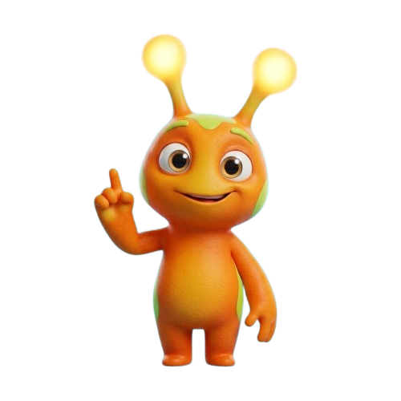
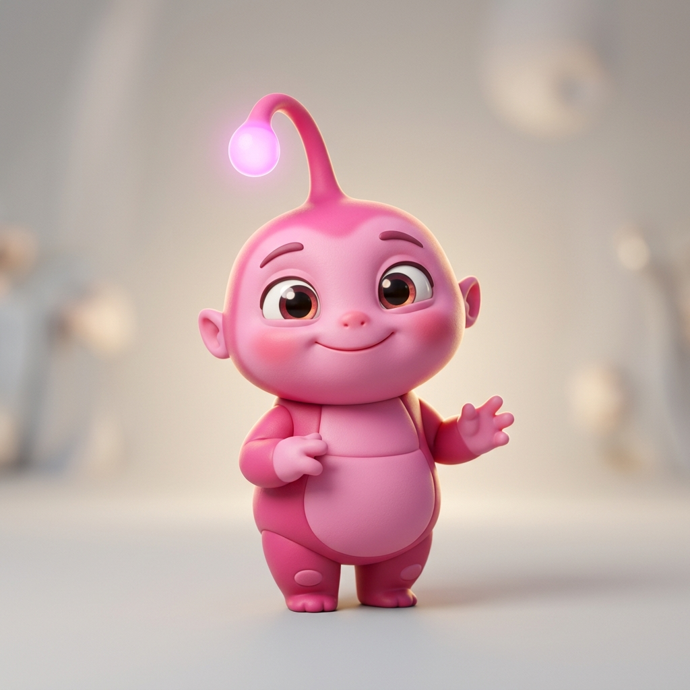
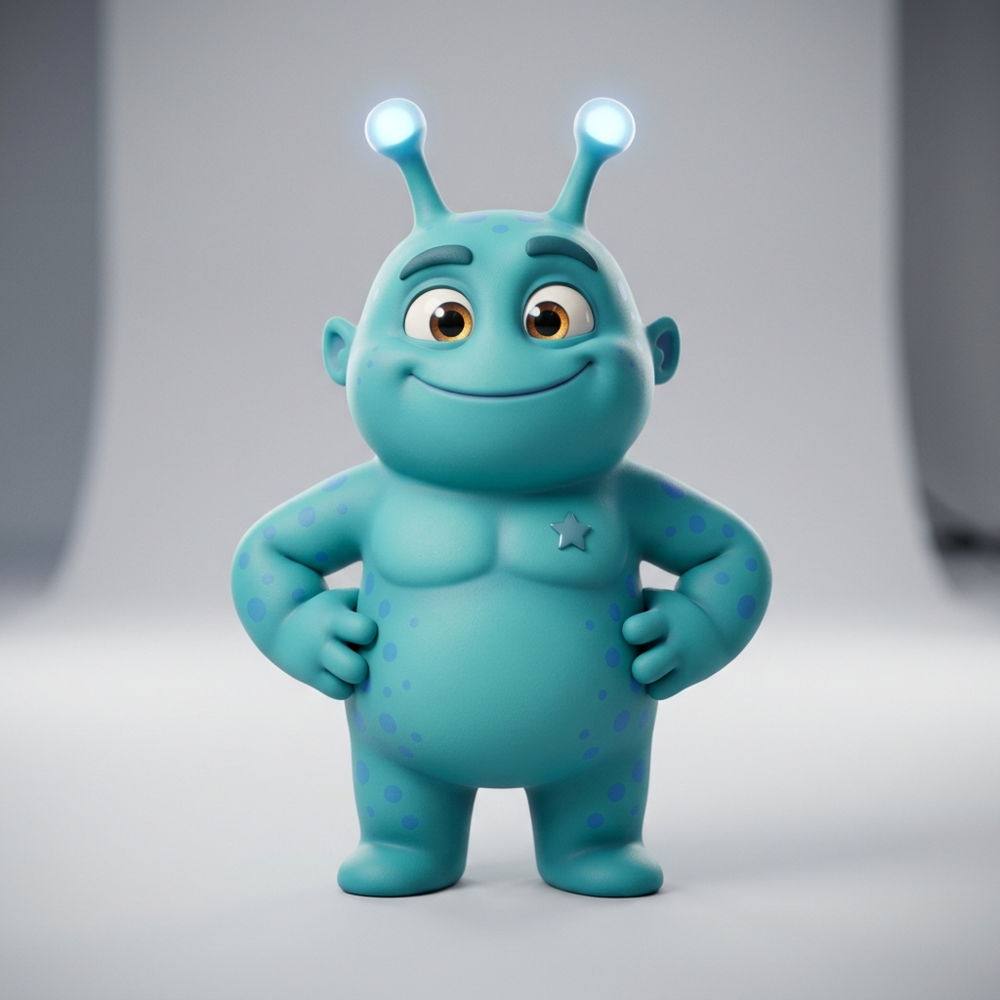

# CodesRock Labs — Master Brand Guide
*Version 1.0 (July 2026)*

Welcome to the definitive Brand Guide for **CodesRock Labs**. This document sets the standards for our visual identity, user experience, mascot implementation, tone of voice, and front-end development styles across our websites (`codesrock.com`), our gamified learning portal (`Teacher Hub` / `Quest Hub`), and our social media channels.

---

## 1. Brand Mission & Core Identity

CodesRock Labs is built on the belief that the future of STEM education is active, collaborative, and unplugged. 

*   **Our Core Vision:** To empower children to master computational thinking and logical reasoning *before* they ever touch a screen.
*   **The Problem We Solve:** Traditional STEM curricula require expensive computer labs and introduce harmful screen-time habits. We eliminate this setup friction and health concern with physical robotics and tactile, unplugged programming cards.
*   **Brand Pillars:**
    1.  **Playful & Energetic:** Learning should feel like an adventure (Planet Logix) rather than a chore.
    2.  **Premium Tech:** Gamified elements and interfaces that feel like modern high-end gaming consoles.
    3.  **African-Centric to Global:** Originating with local representation (like Ghanaian and West African children collaborating), expanding to solve a global educational need.
    4.  **Error-Positive:** We celebrate bugs! A wrong turn by a robot is a perfect opportunity for kids to debug together.

---

## 2. Color Palette & Palette Roles

The CodesRock color system is highly vibrant, balancing the playful nature of learning tools with the neon tech aesthetics of modern dashboards.

### Primary Color Definitions

| Color Name | Hex Code | HSL Representation | Design/Brand Role |
| :--- | :--- | :--- | :--- |
| **Rocky Orange** | `#FF7340` | `15 100% 63%` | **Secondary Brand Color (CTA & Highlight):** Represents Rocky, energy, and primary buttons. |
| **Bolt Blue / Teal** | `#46C5D5` | `187 61% 55%` | **Primary Brand Color (Trust & Tech):** The dominant brand hue, representing logic and clarity. |
| **Pixie Pink** | `#EC4899` | `330 81% 60%` | **Creative Accent Color:** Used for rewards, achievements, and unique learning paths. |
| **Growth Yellow** | `#FDC82F` | `45 98% 59%` | **Reward Color:** Used for unlocked certificates, stars, badges, and warning states. |
| **Deep Purple** | `#5D3B98` | `261 44% 41%` | **Structural Color:** Dominant in gradients, text weights, grid lines, and shadows. |

### Canvas & Base Colors

*   **Background (Light):** `hsl(210, 50%, 98%)` (Clean, cool off-white with a hint of blue).
*   **Background (Dark):** `hsl(224, 71.4%, 4.1%)` (Deep slate/navy, used as the base for the Quest Portal).
*   **Card/Surface (Light):** `hsl(0, 0%, 100%)` (Pure white for contrast on light canvas).
*   **Card/Surface (Dark):** `hsl(224, 71.4%, 4.1%)` (Deep slate with glassmorphism overlays).

---

## 3. Typography & Styling Hierarchy

We pairing a friendly, rounded font for headers with a clean, highly legible font for technical content.

*   **Headings Font:** `Nunito` (Sans-serif)
    *   *Usage:* Title cards, navigation menus, badges, and major headings.
    *   *Aesthetic:* Round, approachable, friendly, bold.
*   **Body & Technical Font:** `Inter` (Sans-serif)
    *   *Usage:* Instructions, dashboard logs, dates, database stats, and description text.
    *   *Aesthetic:* Clean, modern, highly readable at all screen sizes.

```css
/* Google Fonts Import */
@import url('https://fonts.googleapis.com/css2?family=Inter:wght@400;500;600;700;800;900&family=Nunito:ital,wght@0,400;0,600;0,700;0,800;0,900;1,800&display=swap');
```

---

## 4. The CodesRock Mascot & Character Universe

Our mascot-centric approach bridges digital software with physical play. Mascots act as companions, mentors, and guides.



### A. Rocky "The Logic Star" (Primary Mascot)
*   **Origin:** Planet Logix
*   **Mission:** To guide students and teachers through the rhythmic beats of logical thinking.
*   **Anatomy Specification:**

| Feature | Visual Requirement | Color Reference |
| :--- | :--- | :--- |
| **Body Shape** | Rounded, compact alien body. Pear-shaped, ~3 heads tall. Pixar-lite proportions. Lighter yellow-orange face. | Orange `#FF7340` / Yellow gradient |
| **Head Patches** | A lime-green crest on the forehead between the antennae, and matching lime-green cheek/side patches. | Lime-green `#7CFC00` |
| **Body Patches** | Solid lime-green panels/flanks on the sides of the body (under armpits to hips). Orange center chest. | Lime-green `#7CFC00` |
| **Antennae** | Two springy orange antennae rising from the head crest, ending in glowing warm yellow-green bulbous tips. | Tips glow warm yellow-green |
| **Accent Markings** | Orange ridges/eyebrows above the eyes. No tail or randomly scattered body dots. | Orange `#FF7340` |
| **Soles** | Lime-green oval patches on the soles of the feet. | Lime-green `#7CFC00` |
| **Eyes** | Large, round, warm brown eyes with visible reflection highlights. Always friendly. | Brown / White |

*   **Key Poses:**
    *   *Idea Pose:* Pointing index finger up to signify a breakthrough.
    *   *Celebration / Rock On 🤘:* Right hand raised in "rock on" sign, mouth open in excitement.
    *   *Wave:* Greeting students on landing pages.
    *   *Hands-on-Hips:* Confident posture next to progress trackers.

### B. The Logic Squad (Friends & Future Extensions)
Rocky is joined by friends who represent different aspects of coding, which can be expanded as the brand grows:

1.  **Pixie (The Creative Loop)**
    *   *Anatomy:* Pink `#EC4899` body, slightly smaller than Rocky. A single antenna with a glowing pink tip.
    *   *Personality:* Curious, playful, focuses on repetitive patterns (loops) and creative algorithms.
    
    

2.  **Bolt (The Direct Step)**
    *   *Anatomy:* Teal/Cyan `#46C5D5` body, stocky frame. Two short antennae with glowing cyan-white tips. Accentuated with blue dot patterns.
    *   *Personality:* Confident, logical, representing direction, sequencing, and straight paths.
    
    

3.  **Expanding the Universe:** Future characters must follow the formula:
    *   Monochromatic main body (derived from brand colors: e.g. Yellow, Light Blue).
    *   Simple, rounded silhouette with tactile vinyl texture.
    *   Bulbous, glowing antennae that act as visual status indicators.
    *   Incorporated design elements (e.g. kente-inspired patterns, gear shapes, or geometric accents).

### C. Background Environments

*   **Planet Logix (Story-driven/Visuals):** Deep purple-to-cyan starry skies, floating logic-block islands, bioluminescent flora (cyan/magenta), crystal formations, and grid pathway markings on the stone ground.
*   **Classroom Environment (Grounding/Testimonials):** Bright, modern classroom, wooden/light floors, whiteboard, physical cards, and books. **CRITICAL EXCLUSION:** Under no circumstances should screens (laptops, phones, tablets, monitors) be visible in any classroom visuals.

---

## 5. UI & Web Portal Design Patterns

Our web portals (such as the Teacher Hub dashboard) combine clean enterprise dashboards with game HUD interfaces.

### Core Visual Components
1.  **Glassmorphism Cards (`.glass-panel`):**
    *   Used for widgets, level progress, and stats.
    *   *Light Mode:* Semi-transparent white (`bg-white/70`) with high backdrop blur (`backdrop-blur-md`), thin white border, and soft drop shadow.
    *   *Dark Mode:* Semi-transparent slate (`bg-slate-900/70`) with soft white/10 border.
2.  **Logic Spark Cloud (Speech Bubbles):**
    *   Rocky's dialogs appear in a frosted glass cloud style.
    *   Includes a digital sparkle/code rain effect.
    *   Rounded corners (`rounded-[2rem]`) and a triangular bottom-left tail rotated 45 degrees.
3.  **Radial Glow Backgrounds:**
    *   Atmospheric lighting utilizing low-opacity gradients at the viewport corners (`--primary`, `--secondary`, and `--accent` at 5% opacity).

---

## 6. Front-End Integration: Tailwind CSS Configuration

Developers must integrate the brand guide directly into their projects. Below is the standard configuration file for Tailwind CSS used in our Vite/React codebase.

```typescript
// tailwind.config.ts
import type { Config } from "tailwindcss";

export default {
  darkMode: ["class"],
  content: [
    "./index.html",
    "./src/**/*.{ts,tsx}",
  ],
  theme: {
    extend: {
      fontFamily: {
        heading: ["Nunito", "sans-serif"],
        body: ["Inter", "sans-serif"],
      },
      colors: {
        border: "hsl(var(--border))",
        input: "hsl(var(--input))",
        ring: "hsl(var(--ring))",
        background: "hsl(var(--background))",
        foreground: "hsl(var(--foreground))",
        primary: {
          DEFAULT: "hsl(var(--primary))",       // #46C5D5 Teal/Blue
          foreground: "hsl(var(--primary-foreground))",
        },
        secondary: {
          DEFAULT: "hsl(var(--secondary))",     // #FF7340 Orange
          foreground: "hsl(var(--secondary-foreground))",
        },
        accent: {
          DEFAULT: "hsl(var(--accent))",        // #EC4899 Pink
          foreground: "hsl(var(--accent-foreground))",
        },
        destructive: {
          DEFAULT: "hsl(var(--destructive))",
          foreground: "hsl(var(--destructive-foreground))",
        },
        muted: {
          DEFAULT: "hsl(var(--muted))",
          foreground: "hsl(var(--muted-foreground))",
        },
        card: {
          DEFAULT: "hsl(var(--card))",
          foreground: "hsl(var(--card-foreground))",
        },
        "deep-purple": "#5D3B98",
        sidebar: {
          DEFAULT: "hsl(var(--sidebar-background))",
          foreground: "hsl(var(--sidebar-foreground))",
          primary: "hsl(var(--sidebar-primary))",
          "primary-foreground": "hsl(var(--sidebar-primary-foreground))",
          accent: "hsl(var(--sidebar-accent))",
          "accent-foreground": "hsl(var(--sidebar-accent-foreground))",
          border: "hsl(var(--sidebar-border))",
          ring: "hsl(var(--sidebar-ring))",
        },
      },
      borderRadius: {
        lg: "var(--radius)",
        md: "calc(var(--radius) - 2px)",
        sm: "calc(var(--radius) - 4px)",
        "3xl": "1.5rem",
        "4xl": "2rem",
      },
      keyframes: {
        float: {
          "0%, 100%": { transform: "translateY(0)" },
          "50%": { transform: "translateY(-15px)" },
        },
        "bounce-subtle": {
          "0%, 100%": { transform: "translateY(0)" },
          "50%": { transform: "translateY(-5px)" },
        },
        "fade-in-up": {
          "0%": { opacity: "0", transform: "translateY(20px)" },
          "100%": { opacity: "1", transform: "translateY(0)" },
        },
        "scale-in": {
          "0%": { opacity: "0", transform: "scale(0.9)" },
          "100%": { opacity: "1", transform: "scale(1)" },
        },
      },
      animation: {
        float: "float 4s ease-in-out infinite",
        "bounce-subtle": "bounce-subtle 2s ease-in-out infinite",
        "fade-in-up": "fade-in-up 0.6s ease-out forwards",
        "scale-in": "scale-in 0.4s ease-out forwards",
        "spin-slow": "spin 8s linear infinite",
      },
    },
  },
  plugins: [require("tailwindcss-animate")],
} satisfies Config;
```

---

## 7. Tone of Voice & Marketing Pillars

All copywriting, social media campaigns, and portal instructions must sound consistent and "Rocky-centric".

*   **Rocky's Voice:** Speak in the first person ("I", "My"). Rocky is an enthusiastic guide who loves wordplay and rhythm.
*   **Signature Sign-offs:**
    *   "Keep Rocking the Code! 🤘"
    *   "Logic sparks flying! ✨"
*   **Language Guidelines:**
    *   *Yes:* "Logic beat", "coding rhythm", "debugging puzzle", "unplugged logic", "hands-on algorithm".
    *   *No:* "Screen", "click here", "tap your tablet", "monitor", "programming environment".
*   **Hashtag Toolkit:**
    #CodesRock #ScreenFreeSTEM #CodeWithoutScreens #EarlySTEM #LogicSquad #FutureReadyKids
