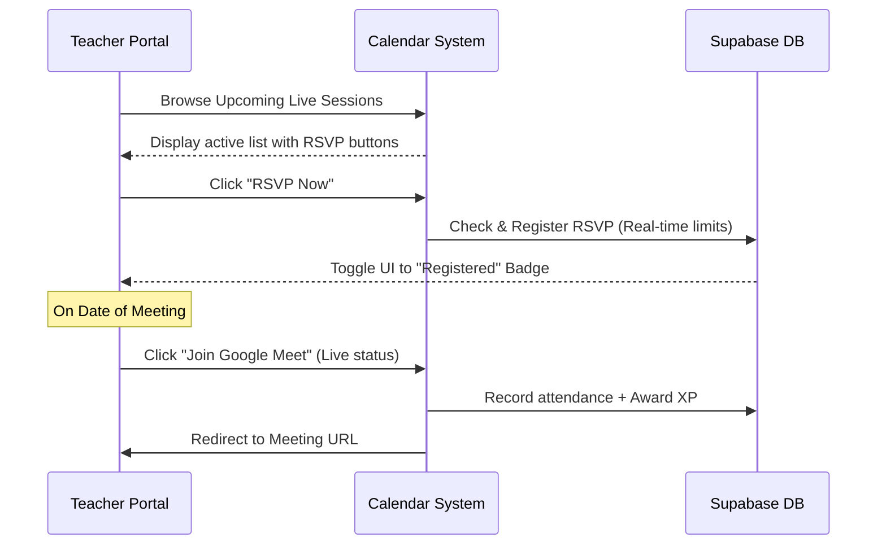
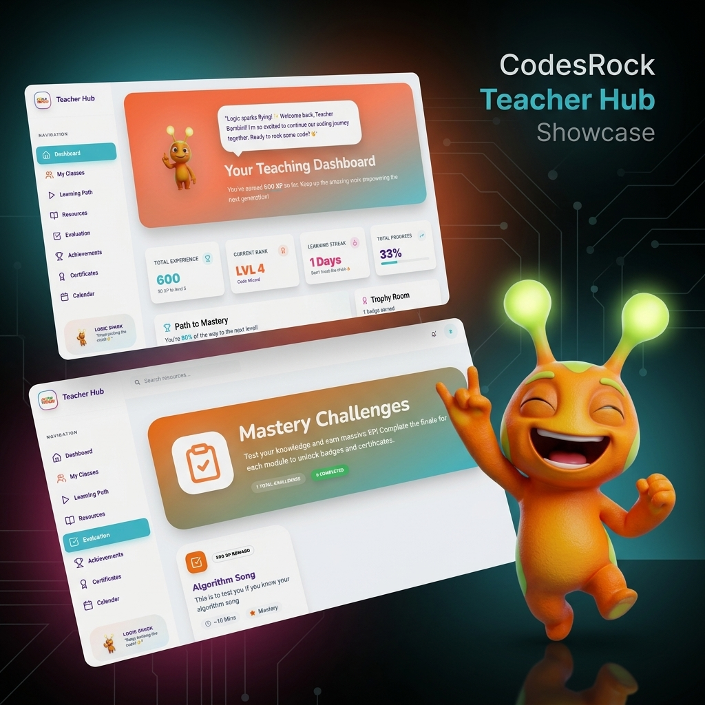
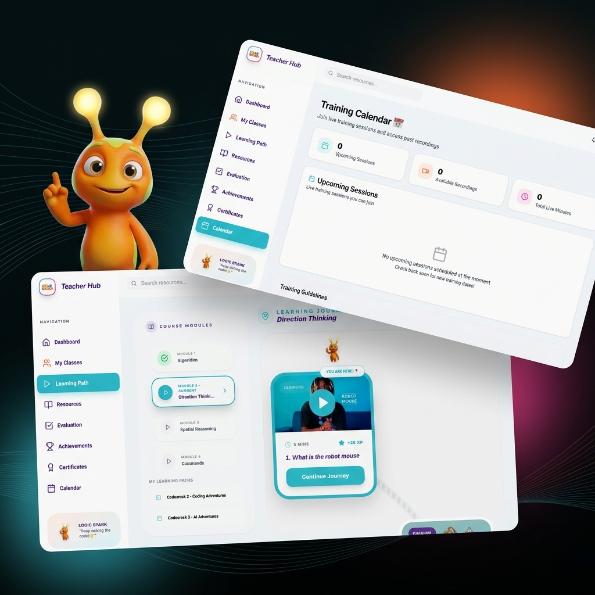
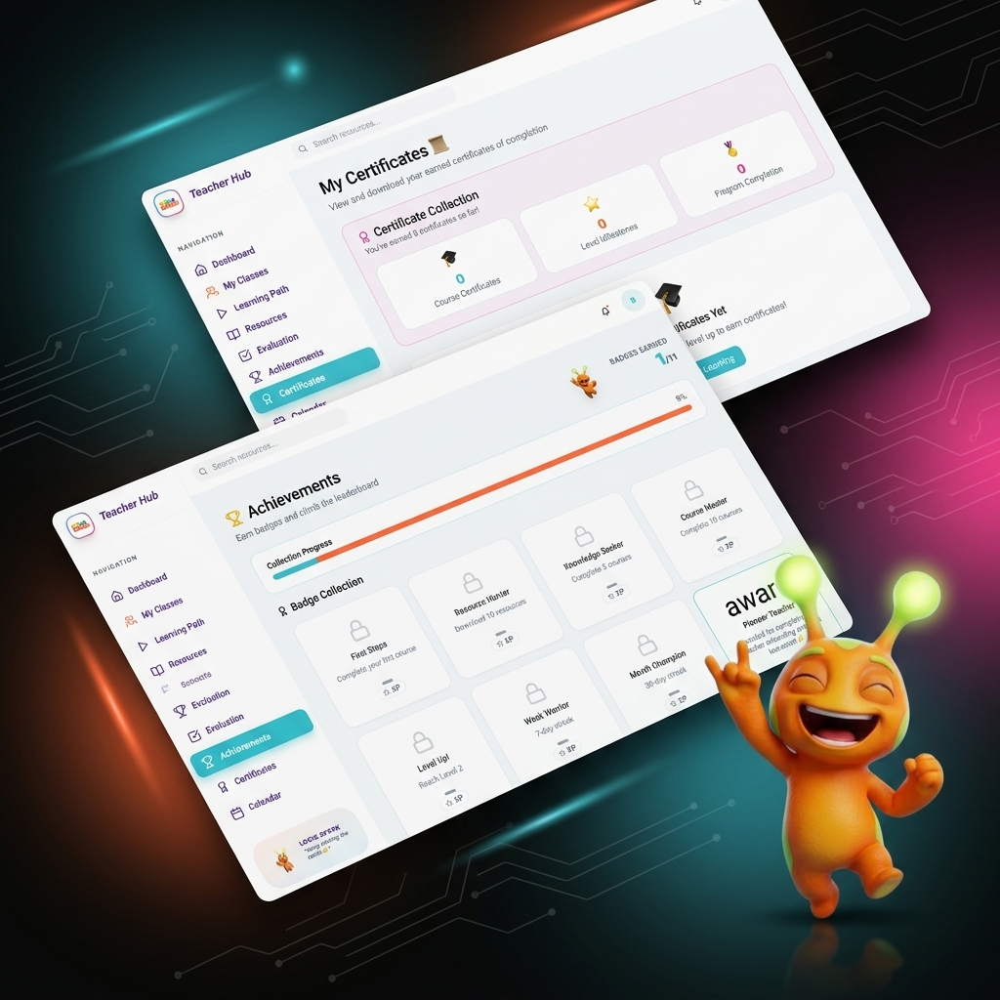

# CodesRock Teacher Hub: Design & Visual Portfolio
*A gamified professional development portal empowering teachers to lead cutting-edge STEM and screen-free coding classes.*

---

## Executive Overview
One of the largest hurdles primary schools face in adopting STEM curricula is the **teacher-training burden**. School owners worry their staff lacks the technical confidence or specialized skills to teach coding. 

The **CodesRock Teacher Hub** (Quest Hub) solves this problem by turning professional development into an interactive, gamified journey. Instead of dry lectures, teachers progress through styled "Quests," watch short instruction videos, participate in live training, and earn certificates and badges. It elevates educators into confident STEM coaches, making school integration seamless.

This design portfolio outlines the core visual language, user experience, and interactive features of the portal.

---

## 1. Brand Identity & Visual Language (codesrock.com Theme)
The design system balances the playful nature of gamified learning with the premium tech aesthetic of the main `codesrock.com` platform.

### Design Tokens

| Property | Value | Marketing / Branding Purpose |
| :--- | :--- | :--- |
| **Primary Theme** | Dark Mode with soft radial glows | Reduces eye strain; feels modern and gaming-inspired. |
| **Primary Teal (Trust/Tech)** | `#46C5D5` | Represents logic, clarity, and tech-forward learning. |
| **Action Orange (CTA/Energy)** | `#FF7340` | Inspires energy, active coding, and CTA highlights. |
| **Creative Accent Pink** | `#EC4899` | Highlights special achievements, rewards, and custom paths. |
| **Growth Yellow** | `#FDC82F` | Used for unlocked badges, rating stars, and certificates. |
| **Deep Purple** | `#5D3B98` | Dominant text, structural borders, and header weight. |
| **Typography (Headings)** | `Nunito` | Rounded, friendly, and clean sans-serif typeface. |
| **Typography (Body)** | `Inter` | Exceptional legibility for instructions, dates, and reports. |
| **Styling Concept** | Glassmorphism (`.glass-panel`) | Semi-transparent frosted panels (`white/70` or `slate-900/70`) with subtle borders and heavy blurs to create high depth. |

---

## 2. Interactive Coach Dashboard
The Dashboard serves as the central hub for the teacher's learning journey. Designed around behavioral psychology, it features clear progress metrics to drive daily engagement.

### Key Components:
* **Circular Level Progress**: A central gauge indicating the teacher's current level (e.g., Level 4, "Logic Master") and percentage progress to the next level-up.
* **Frosted Glass Cards**: Clean displays for stats like **Cumulative XP**, **Daily Active Streaks** (encouraging consistency), and **Badges Earned**.
* **Current Quest Prompts**: A distinct card guiding the user to their next training activity immediately upon login.

---

## 3. The Interactive Quest Map
The curriculum is presented as a branching **Quest Map** similar to modern skill trees in RPG games. This turns linear lesson plans into a visual adventure.

### Key Components:
* **Interactive Hexagonal Nodes**: Each topic is represented by a styled node displaying status: *Completed* (glowing green/teal), *Active* (pulsing orange), or *Locked* (muted gray).
* **Glow Connections**: Neon paths connecting nodes show course prerequisites, giving teachers a clear roadmap.
* **Side Drawers**: Clicking a node slides open a detail pane showing lesson summaries, XP awards, video progress, and a "Start Lesson" action button.

---

## 4. Mastery Challenges & Evaluations
At the end of each module, teachers complete **Mastery Challenges** to test their screen-free coding knowledge.

### Key Components:
* **Challenge Interface**: Frosted cards showing active module tests (e.g. "Algorithm Song").
* **Interactive Feedback**: Immediate progress logs and badges on submission.
* **Validation Checkmarks**: Clean, brand-colored checkmarks highlighting successfully completed assessments.

---

## 5. Live Sessions & Calendar
The Calendar ensures teachers remain synchronized with live training opportunities hosted by senior instructors.



### UX Features:
* **Dynamic RSVP Toggling**: Displays real-time participant counts (e.g. `12 / 50`) and prevents double-registrations.
* **Attendance validation**: Automatically awards XP and updates teacher profile statistics the moment they click "Join Google Meet" during live sessions.
* **Contextual Guidelines**: Help cards detailing Google Meet instructions and a clear support email (`hello@codesrock.com`).

---

## 6. Official Mascot: Rocky "The Logic Star"
To make the learning journey organic, teachers are guided by **Rocky**, the official CodesRock mascot.
* **Visual Profile**: Vibrant orange body with lime-green accent patterns, glowing thinker antennae, and a premium 3D soft-touch (Pixar-lite) texture.
* **Role**: Appears in walkthroughs, tour guides, and celebrations to cheer coaches on.
* **Narrative Voice**: Rhythmic, enthusiastic, and encourages coaches with a signature speech bubble (the *Logic Spark Cloud*).

---

## 7. Marketing Portfolio Masonry Grid Options
Below is an interactive carousel of the B2B marketing mockups. Each layout places the actual screenshots of the application (Dashboard, Evaluation, Quest Map, Calendar, Achievements, and Certificates) as tilted Behance-style cards, integrated with the transparent **Rocky 3D** mascot in high-energy poses against the codesrock.com neon tech background.

````carousel

<!-- slide -->

<!-- slide -->

````

---

## 8. Value Proposition for B2B Partners (Schools)
When pitching CodesRock to school owners and principals, the Teacher Hub serves as a key B2B selling point:

1. **Eliminate Instructor Scarcity**: Schools do not need to hire expensive computer science graduates. The Teacher Hub trains existing homeroom teachers from scratch.
2. **Trackable Professional Development**: School administrators get an admin dashboard showing their teachers' learning progress, courses completed, and active certifications.
3. **No Setup Friction**: The platform is built as a zero-setup web application, syncable with CodesRock's screen-free robotic hardware kits.
