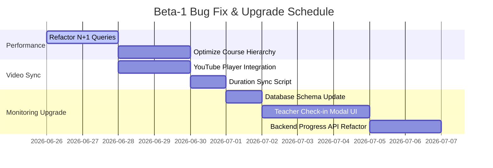

# CodesRock Teacher Application: Bug Diagnosis & Performance Optimization Plan

This planning document outlines the technical diagnoses, proposed database and code refactors, and implementation roadmap to address issues identified during the initial beta test with early-adopter schools.

---

## 1. Bug Diagnoses & Technical Solutions

### Issue A: Page Load Slowness (My Classes & Learning Path Navigation)

*   **Symptom**: When a teacher navigates to "My Classes" or the "Learning Path", the screen hangs on a loader or takes several seconds to successfully render the cards.
*   **Root Cause 1 (N+1 Query in `getTeacherClasses`)**:
    In [classController.ts](file:///Users/user/Documents/Software%20Development/codesrock-quest-hub/codesrock-backend/src/controllers/classController.ts#L44-L51), the controller retrieves a list of classes for a teacher, and then maps over that list to issue a separate `select count` query *per class* to get the student counts. For a teacher with $N$ classes, this fires $N+1$ database requests:
    ```typescript
    const classesWithCounts = await Promise.all((classes || []).map(async (cls) => {
      const { count } = await supabase
        .from('class_students')
        .select('*', { count: 'exact', head: true })
        .eq('class_id', cls.id);
      return { ...cls, studentCount: count || 0 };
    }));
    ```
*   **Root Cause 2 (Lack of Aggregated Indices)**:
    While basic indices exist, there are no composite indices on `class_students(class_id, student_id)` and `student_topic_progress(student_id, topic_id)` which are heavily queried in combination with RLS policies, leading to full table scans as active records grow.
*   **Proposed Fixes**:
    1.  **Refactor N+1 Query**: Modify the backend to fetch all classes and student counts in a single query by using a group-by count query on `class_students` or joining aggregated counts:
        ```typescript
        // Select student counts grouped by class_id for all the teacher's classes in one single database roundtrip
        const classIds = classes.map(c => c.id);
        const { data: countsData, error: countsError } = await supabase
          .from('class_students')
          .select('class_id')
          .in('class_id', classIds);
        
        const countMap = new Map();
        (countsData || []).forEach(row => {
          countMap.set(row.class_id, (countMap.get(row.class_id) || 0) + 1);
        });
        ```
    2.  **Optimize Learning Path Data Pull**: Paginate or cache course hierarchies. Currently, [courseController.ts](file:///Users/user/Documents/Software%20Development/codesrock-quest-hub/codesrock-backend/src/controllers/courseController.ts#L28-L37) pulls all topics and videos into memory to build counts. We will introduce database-level view aggregations or cache course structures in Redis/memory since curriculum lists are static.
    3.  **Add Composite Indices**: Run a migration to add search indices for RLS verification joins:
        ```sql
        CREATE INDEX IF NOT EXISTS idx_class_students_composite ON class_students(class_id, student_id);
        ```

---

### Issue B: Videos Do Not Show Actual Duration

*   **Symptom**: The lesson cards and video player header in the UI show static placeholder durations (e.g. `0m` or pre-populated course-level values) instead of the actual length of the YouTube video.
*   **Root Cause**: In [course_hierarchy_migration.sql](file:///Users/user/Documents/Software%20Development/codesrock-quest-hub/codesrock-backend/migrations/course_hierarchy_migration.sql#L65-L70), the autogenerated video records are populated by copying course metadata duration (which is course-level, not video-level). There is no automated sync with the YouTube IFrame API or backend YouTube crawler to parse the actual length of the linked video asset.
*   **Proposed Fixes**:
    1.  **Client-Side Auto-Reporting**: Update [YouTubePlayer.tsx](file:///Users/user/Documents/Software%20Development/codesrock-quest-hub/codesrock-frontend/src/components/video/YouTubePlayer.tsx#L85-L99) to capture the true duration when the video is loaded (`ytPlayer.getDuration()`). If it differs from the database-reported duration, trigger a silent metadata update endpoint:
        ```typescript
        const totalDurationSeconds = ytPlayer.getDuration();
        const durationInMinutes = Math.ceil(totalDurationSeconds / 60);
        if (durationInMinutes > 0 && durationInMinutes !== watchingVideo.duration) {
          await courseService.updateVideoDuration(watchingVideo.id, durationInMinutes);
        }
        ```
    2.  **Backend Maintenance Script**: Create an offline utility script in `src/scripts/sync-youtube-durations.ts` that fetches all videos, extracts YouTube IDs, queries the YouTube Data API `v3/videos` contentDetails endpoint, and patches the `duration` column in PostgreSQL.

---

### Issue C: Shallow Student Monitoring (Simple Checkbox)

*   **Symptom**: Ticking off topic completion feels shallow. Teachers cannot indicate the quality of work, students' understanding of logic concepts, or behavior in unplugged activities.
*   **Root Cause**: The current `student_topic_progress` schema only tracks a binary complete state:
    ```sql
    CREATE TABLE student_topic_progress (
      id UUID PRIMARY KEY,
      student_id UUID NOT NULL,
      topic_id UUID NOT NULL,
      teacher_id UUID,
      completed_at TIMESTAMPTZ,
      notes TEXT
    );
    ```
*   **Proposed Fixes**:
    1.  **Schema Upgrade (Deep Monitoring Migration)**: Migrate `student_topic_progress` to capture granular classroom metrics:
        ```sql
        ALTER TABLE student_topic_progress 
          ADD COLUMN IF NOT EXISTS mastery_level TEXT CHECK (mastery_level IN ('struggling', 'developing', 'proficient', 'advanced')),
          ADD COLUMN IF NOT EXISTS engagement_score INTEGER CHECK (engagement_score >= 1 AND engagement_score <= 5),
          ADD COLUMN IF NOT EXISTS assessment_score INTEGER,
          ADD COLUMN IF NOT EXISTS max_assessment_score INTEGER DEFAULT 10,
          ADD COLUMN IF NOT EXISTS activity_type TEXT CHECK (activity_type IN ('unplugged_game', 'card_sorting', 'robot_navigation', 'activity_book')),
          ADD COLUMN IF NOT EXISTS session_date DATE DEFAULT CURRENT_DATE;
        ```
    2.  **UI Redesign (The Lesson Check-in Modal)**:
        Replace the binary checkbox on the student tracking grid with a slide-out drawer or dialog. When a teacher marks a module section as completed for a student, they are presented with:
        *   **Mastery Rating**: 4-button selector (Struggling 🔴, Developing 🟡, Proficient 🟢, Advanced 💎).
        *   **Engagement Slider**: 1 to 5 stars.
        *   **Activity Book Check**: Input field to record their score on the corresponding page of the CodesRock Activity Book (e.g., $X/10$ logic puzzles correct).
        *   **Activity Type**: Dropdown selecting the main mode of engagement (e.g. Unplugged Kinesthetic Game, Rockbot Mat Navigation, Card Sorting).
        *   **Teacher Notes**: Rich-text area for behavioral logs.

---

## 2. Implementation Roadmap



### Phase 1: Performance & Video Sync (Weeks 1)
*   Deploy N+1 refactors in `classController.ts`.
*   Establish database indexing and composite keys.
*   Integrate dynamic YouTube video duration syncing.

### Phase 2: Monitoring System Overhaul (Week 2)
*   Apply the database migrations for granular student logs.
*   Create the frontend "Lesson Check-in Dialog" with slider stars and mastery buttons.
*   Integrate this data into the **StudentReport** and **Analytics** screens so schools get rich performance metrics.
